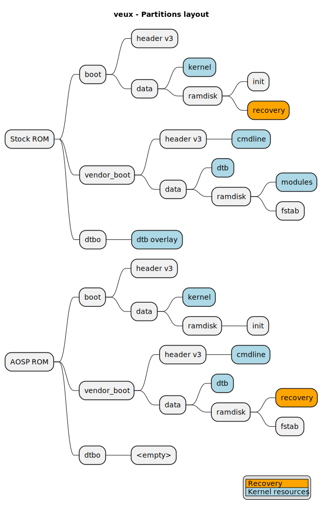

# recovery partition
veux/peux does not have dedicated `recovery` partition

The actual recovery resides in either `boot` or `vendor_boot` partition, depending on your current ROM.



Do not try to `fastboot boot recovery.img`, it will not work.

## DO NOT
```
fastboot flash boot boot.img
fastboot reboot
```
or this,
```
fastboot flash vendor_boot vendor_boot.img
fastboot reboot
```
or this,
```
fastboot flash boot boot.img
fastboot flash vendor_boot vendor_boot.img
fastboot reboot
```
or this,
```
fastboot flash dtbo dtbo.img
fastboot reboot
```
because you are about to update kernel components, and you may face:
- stuck in fastboot/bootloader mode
- bootloop
- broken drivers (modem, wi-fi, bluetooth...)

## DO
```
fastboot flash boot boot.img
fastboot flash vendor_boot vendor_boot.img
fastboot flash dtbo dtbo.img
fastboot reboot recovery
```
You can use this method to:
- repair a soft-brick
- uninstall custom recovery, custom kernel, root
- revert to original ROM state
- install a different ROM

To make sure these 3 `.img` files are working, they must be extracted from your current ROM, or the ROM you are about to install
- For MIUI/HyperOS (fastboot installer only), look inside `images` directory
- For AOSP, your maintainer should provide them. If not, use [payload-dumper-go](https://github.com/ssut/payload-dumper-go) to extract these from the OTA package
- For ported/modded ROM, your maintainer should provide them
